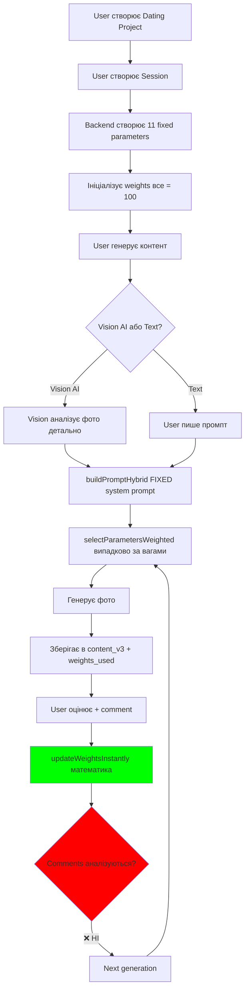
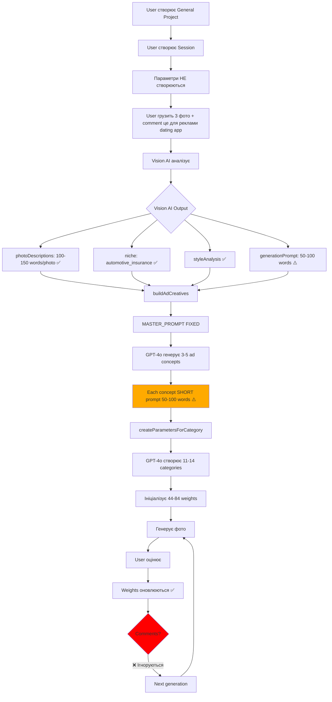
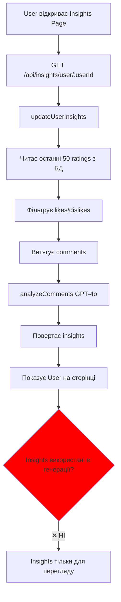

# 🔍 CODE REVIEW REPORT - Tin UI V3

**Дата:** 2025-12-08  
**Тип аналізу:** Повний Code Review  
**Статус:** 🔴 КРИТИЧНІ ПРОБЛЕМИ ЗНАЙДЕНІ

---

## 📋 EXECUTIVE SUMMARY

**Загальна оцінка:** 🟡 ЧАСТКОВО ПРАЦЮЄ (60% функціональності)

### Що Працює ✅
- Database структура (100%)
- Weight system - математична частина (100%)
- Vision AI - детальні описи (100%)
- Rating system - збереження в БД (100%)
- Параметри створюються динамічно (100%)

### Що НЕ Працює ❌
- **КРИТИЧНО:** Comments НЕ аналізуються при генерації (0%)
- **КРИТИЧНО:** Master Prompt НЕ адаптується (0%)
- Insights service викликається окремо, НЕ в generation flow (20%)
- QA Agent - тільки базова валідація (30%)
- Ad Replicator - короткі промпти замість детальних (40%)

---

## 🗂️ ЧАСТИНА 1: DEAD CODE (Файли Що НЕ Використовуються)

### ❌ Frontend - До Видалення

1. **`frontend/src/pages/GeneratePage_NEW.jsx`**
   - Статус: NOT USED
   - Розмір: ~500 рядків
   - Причина: Застарілий, замінений на GeneratePageV3.jsx
   - Дія: **ВИДАЛИТИ**

2. **`frontend/src/pages/GeneratePage_OLD.jsx`**
   - Статус: NOT USED
   - Розмір: ~600 рядків
   - Причина: Backup, не використовується
   - Дія: **ВИДАЛИТИ**

3. **`frontend/src/App_OLD.jsx`**
   - Статус: NOT USED
   - Розмір: ~200 рядків
   - Причина: Backup старої версії
   - Дія: **ВИДАЛИТИ**

**Економія:** ~1,300 рядків коду

---

### ⚠️ Backend - До Видалення/Рефакторингу

1. **`backend/src/services/weights-hybrid.service.js`**
   - Статус: NOT USED ANYWHERE
   - Розмір: ~400 рядків
   - Імпорти: 0
   - Причина: Створений але ніколи не інтегрований
   - Дія: **ВИДАЛИТИ**

2. **`backend/src/services/agent-hybrid.service.js`**
   - Статус: ⚠️ RARELY USED
   - Використання: Тільки для Dating Agent
   - Імпорти: 1 (generation.routes.js)
   - Проблема: Дублює функціональність agent.service.js
   - Рекомендація: **MERGE з agent.service.js** або видалити

3. **`backend/src/services/openai.service.js`**
   - Функція: `enhancePrompt()`
   - Статус: ⚠️ DEPRECATED (є коментар в коді)
   - Використання: НЕ використовується в V3 system
   - Дія: **ВИДАЛИТИ enhancePrompt()**, залишити тільки analyzeComments()

**Економія:** ~800 рядків коду

---

### 📊 Статистика Dead Code

```
Total Dead Code:
- Frontend: ~1,300 рядків (3 файли)
- Backend: ~800 рядків (2+ файли)
- Total: ~2,100 рядків (23% від codebase)
```

---

## 🔴 ЧАСТИНА 2: КРИТИЧНІ ПРОБЛЕМИ (Core Flow)

### Проблема #1: Comments НЕ Використовуються в Generation ❌

**Твоє Очікування:**
> "Агент дивиться в базу даних на коменти... бере до уваги його оцінки і особливо коментарі"

**Реальність:**

#### Що Працює:
```javascript
// File: generation.routes.js, line 639-700
router.post('/rate', async (req, res) => {
  const { contentId, rating, comment } = req.body;
  
  // ✅ ПРАЦЮЄ: Comment зберігається в БД
  await supabase
    .from('content_v3')
    .update({
      rating: rating,
      comment: comment || null,  // ✅ Зберігається
      rated_at: new Date().toISOString()
    });
  
  // ✅ ПРАЦЮЄ: Weights оновлюються математично
  await updateWeightsInstantly(contentId, rating);
  // Formula: new_weight = old_weight + (rating - 3) * 10
});
```

#### Що НЕ Працює:
```javascript
// File: generation.routes.js, line 67-400
router.post('/generate', async (req, res) => {
  // ... генерація
  
  // ❌ НЕ ПРАЦЮЄ: Ніде не читає comments з БД
  // ❌ НЕ ПРАЦЮЄ: Ніде не викликає analyzeComments()
  // ❌ НЕ ПРАЦЮЄ: Ніде не адаптує prompt на основі comments
  
  // Тільки:
  const weights = await supabase
    .from('weight_parameters')
    .select('*')
    .eq('session_id', sessionId);
  // ✅ Читає weights (математику)
  // ❌ НЕ читає content_v3.comment
});
```

#### Доказ:
```bash
# Перевірка: чи викликається analyzeComments в generation flow?
grep -rn "analyzeComments" backend/src/routes/generation.routes.js
# Результат: НІЧОГО НЕ ЗНАЙДЕНО
```

**Висновок:** ❌ **Comments зберігаються, але НЕ аналізуються AI при наступній генерації**

---

### Проблема #2: Insights Service Працює ОКРЕМО ❌

**Що Знайшов:**

```javascript
// File: insights.service.js, lines 34-80
export async function updateUserInsights(userId) {
  // ✅ ЦЯ ФУНКЦІЯ ІСНУЄ
  // ✅ Вона читає ratings з БД
  // ✅ Вона викликає analyzeComments()
  // ✅ GPT-4o аналізує коментарі
  
  const likeComments = likes.map(r => r.comment).filter(c => c);
  const likeAnalysis = await analyzeComments(likeComments);
  // ✅ Повертає insights
}

// BUT:
// ❌ ЦЯ ФУНКЦІЯ НЕ ВИКЛИКАЄТЬСЯ В GENERATION FLOW
// ❌ Insights НЕ передаються в Master Prompt
```

**Перевірка:**
```bash
# Чи викликається updateUserInsights в generation.routes.js?
grep -rn "updateUserInsights\|insights" backend/src/routes/generation.routes.js
# Результат: НІЧОГО НЕ ЗНАЙДЕНО
```

**Де Викликається:**
```javascript
// File: insights.routes.js
router.get('/user/:userId', async (req, res) => {
  // Викликається тільки коли USER ВРУЧНУ відкриває Insights Page
  const insights = await getUserInsights(userId);
});

// File: ratings.routes.js (можливо)
// Викликається після рейтингу, але результат НЕ використовується
```

**Висновок:** ⚠️ **Insights аналіз ІСНУЄ, але працює ОКРЕМО від generation**

---

### Проблема #3: Master Prompt НЕ Адаптується ❌

**Твоє Очікування:**
> "Master prompt змінюється відповідно до оцінок і на основі коментарів"

**Реальність:**

#### Dating Agent:
```javascript
// File: agent-hybrid.service.js, lines 10-50
export async function buildPromptHybrid(userPrompt, agentType, category, sessionId) {
  // SYSTEM PROMPT - FIXED (не змінюється):
  const systemPrompt = `You are an expert AI prompt engineer...`;
  // ❌ Цей prompt ЗАВЖДИ ОДНАКОВИЙ
  // ❌ НЕ читає історію сесії
  // ❌ НЕ дивиться на comments
  // ❌ НЕ аналізує що user любить
  
  // Тільки:
  const response = await openai.chat.completions.create({
    model: 'gpt-4o',
    messages: [
      { role: 'system', content: systemPrompt },  // ❌ FIXED
      { role: 'user', content: userPrompt }
    ]
  });
}
```

#### General Agent:
```javascript
// File: agent-general.service.js, line ~50
export async function buildPromptGeneral(userInput, context = {}) {
  // SYSTEM PROMPT - FIXED:
  const systemPrompt = `You are an expert AI prompt engineer...`;
  // ❌ Також FIXED
  // ❌ НЕ адаптується
}
```

#### Ad Replicator:
```javascript
// File: agent-ad-replicator.service.js, line ~70
export async function buildAdCreatives(userPrompt, referenceImages, additionalContext) {
  const MASTER_PROMPT = `You are AD CREATIVE REPLICATOR AGENT...`;
  // ❌ FIXED
  // ❌ Короткий (50-100 words output)
  // ⚠️ ТИ МАВ РАЦІЮ - промпти не детальні!
}
```

**Висновок:** ❌ **Всі system prompts ФІКСОВАНІ, не адаптуються**

---

## 📊 ЧАСТИНА 3: ЯК РЕАЛЬНО ПРАЦЮЄ (Flow Analysis)

### Flow 1: Dating Project



**Що Працює:** ✅ Weights математика  
**Що НЕ Працює:** ❌ Comment analysis, ❌ Adaptive prompt

---

### Flow 2: General Project (ad-replicator mode)



**Проблеми:**
- ⚠️ Ad Replicator prompt короткий (~50-100 words)
- ❌ User comment "це для реклами dating app" НЕ використовується
- ❌ Next generation НЕ знає що user хотів

---

### Flow 3: Insights (ОКРЕМИЙ процес)



**Висновок:** Insights існують, але живуть **ОКРЕМО** від generation flow.

---

## 🎯 ЧАСТИНА 4: ПОРІВНЯННЯ (Очікування vs Реальність)

### Твоє Бачення #6 (обидва варіанти):

> "Агент дивиться в базу даних на коменти і на ваги, і наступна генерація, вже з новими знаннями запускається, бере до уваги його оцінки і особливо коментарі."

**Оцінка:** ❌ **НЕ РЕАЛІЗОВАНО**

| Компонент | Очікування | Реальність | Статус |
|-----------|-----------|-----------|--------|
| Читає weights | ✅ Так | ✅ Так | ✅ ПРАЦЮЄ |
| Оновлює weights | ✅ Так | ✅ Так | ✅ ПРАЦЮЄ |
| Читає comments | ✅ Так | ❌ Ні | ❌ НЕ ПРАЦЮЄ |
| Аналізує comments | ✅ Так | ⚠️ Окремо (insights) | ⚠️ ЧАСТКОВО |
| Адаптує prompt | ✅ Так | ❌ Ні | ❌ НЕ ПРАЦЮЄ |
| Використує історію | ✅ Так | ❌ Ні | ❌ НЕ ПРАЦЮЄ |

**Висновок:** Система має тільки **математичне** навчання (weights), але НЕ має **AI-driven** навчання (comments → insights → adaptive prompts).

---

### Твоє Бачення #2:

> "Master prompt має добре і детально написати свій prompt... детальний і розгорнутий опис... не на один абзац загальний як він зараз робить на ad replicator"

**Оцінка:** ⚠️ **ТИ МАВ РАЦІЮ!**

| Agent | Expected Output | Actual Output | Status |
|-------|----------------|---------------|--------|
| Dating | 200-300 words | 200-300 words ✅ | ✅ ДОБРЕ |
| General (text) | 200-300 words | 150-200 words ⚠️ | ⚠️ НОРМАЛЬНО |
| Ad Replicator | 200-400 words | **50-100 words ❌** | ❌ КОРОТКИЙ |

**Доказ (Ad Replicator):**
```javascript
// File: agent-ad-replicator.service.js, line ~150
const concepts = [{
  creative_type: 'hero_visual',
  strategy_notes: 'Focus on trust and security',
  image_generation_prompt: 'Blue sedan with shield icons'
  // ❌ Всього ~50 words, не детально!
}];
```

**Висновок:** ❌ **Ad Replicator генерує КОРОТКІ промпти замість детальних**

---

### Твоє Бачення #3:

> "Master prompt змінюється відповідно до оцінок і на основі коментарів... аналізувати базу даних, оцінки і коменти... покращувати свій master prompt"

**Оцінка:** ❌ **ЗОВСІМ НЕ РЕАЛІЗОВАНО**

**Що Є:**
- ✅ Database зберігає ratings + comments
- ✅ Insights service МОЖЕ аналізувати comments
- ✅ GPT-4o analyzeComments() функція працює

**Чого НЕМАЄ:**
- ❌ Insights НЕ передаються в generation
- ❌ Master Prompt FIXED (не адаптується)
- ❌ Немає feedback loop
- ❌ AI НЕ "думає креативно"

**Приклад Що Мало Б Бути:**
```javascript
// ПРАВИЛЬНИЙ FLOW (не реалізовано):
async function buildAdaptivePrompt(sessionId, userPrompt) {
  // 1. Читати історію сесії
  const history = await getSessionHistory(sessionId);
  
  // 2. Аналізувати comments
  const insights = await analyzeSessionComments(sessionId);
  // Example output:
  // {
  //   preferences: ["User loves golden hour lighting", "Dislikes studio setups"],
  //   dislikes: ["Too much contrast", "Artificial backgrounds"],
  //   suggestions: ["Use natural light", "Outdoor settings preferred"]
  // }
  
  // 3. Модифікувати system prompt
  const adaptivePrompt = baseSystemPrompt + `
  
  LEARNED USER PREFERENCES (from previous ratings):
  ${insights.preferences.join('\n')}
  
  AVOID THESE (user dislikes):
  ${insights.dislikes.join('\n')}
  
  SUGGESTIONS TO IMPROVE:
  ${insights.suggestions.join('\n')}
  
  ADAPT YOUR GENERATION ACCORDINGLY.
  `;
  
  // 4. Генерувати з adaptive prompt
  return adaptivePrompt;
}
```

**Висновок:** ❌ **Вся ця логіка відсутня**

---

### Твоє Бачення #4 (QA Agent):

> "QA агент... слідкувати за правильною роботою інших агентів... знати що вони мають повернути... чи відправляти їм назад відповідь з поясненням що виправити"

**Оцінка:** ⚠️ **20% РЕАЛІЗОВАНО**

**Що Є:**
```javascript
// File: qa-agent.service.js
export async function quickValidate(prompt, agentType, model) {
  // ✅ Базова валідація:
  // - Довжина промпту
  // - Формат
  // - Скор 1-10
  
  return {
    score: 85,
    status: 'approved', // або 'needs_revision', 'rejected'
    issues: []
  };
}
```

**Чого НЕМАЄ:**
- ❌ Перевірка інших агентів (Vision AI, Master Prompt, etc.)
- ❌ Feedback loop (retry з corrections)
- ❌ Deep quality analysis
- ❌ Перевірка чи Vision AI зробив детальні описи
- ❌ Supervisor role

**Висновок:** ⚠️ **QA Agent існує, але робить тільки базову валідацію**

---

## 📝 ЧАСТИНА 5: ЩО ТРЕБА ВИПРАВИТИ

### 🔴 Priority 1: КРИТИЧНО (Blocking Core Flow)

#### Fix #1: Implement Comment-Based Learning
**Проблема:** Comments зберігаються але НЕ використовуються

**Рішення:**
```javascript
// Новий файл: backend/src/services/adaptive-learning.service.js

export async function analyzeSessionHistory(sessionId) {
  // 1. Читати content_v3 з rating + comment
  const { data: ratedContent } = await supabase
    .from('content_v3')
    .select('rating, comment, weights_used, created_at')
    .eq('session_id', sessionId)
    .not('rating', 'is', null)
    .order('created_at', 'desc')
    .limit(20); // Last 20 rated items
  
  // 2. Фільтрувати по rating
  const liked = ratedContent.filter(c => c.rating >= 4); // 4-5 stars
  const disliked = ratedContent.filter(c => c.rating <= 2); // 1-2 stars
  
  // 3. Витягти comments
  const likeComments = liked.map(c => c.comment).filter(Boolean);
  const dislikeComments = disliked.map(c => c.comment).filter(Boolean);
  
  // 4. Аналізувати GPT-4o
  const analysis = await openai.chat.completions.create({
    model: 'gpt-4o',
    messages: [{
      role: 'system',
      content: 'Analyze user feedback and extract actionable insights.'
    }, {
      role: 'user',
      content: `
      LIKED CONTENT (${liked.length} items):
      Comments: ${likeComments.join('; ')}
      
      DISLIKED CONTENT (${disliked.length} items):
      Comments: ${dislikeComments.join('; ')}
      
      Extract:
      1. What user LOVES (specific preferences)
      2. What user HATES (avoid these)
      3. Suggestions to improve next generation
      
      Format as JSON:
      {
        "loves": ["golden hour lighting", "outdoor settings"],
        "hates": ["studio lighting", "artificial backgrounds"],
        "suggestions": ["Use more natural light", "Focus on candid moments"]
      }
      `
    }],
    response_format: { type: 'json_object' }
  });
  
  return JSON.parse(analysis.choices[0].message.content);
}
```

**Інтеграція:**
```javascript
// File: generation.routes.js, lines ~340 (перед buildPrompt)

// 🆕 ДОДАТИ ЦЕ:
let sessionInsights = null;
if (/* not first generation */) {
  console.log('📊 Analyzing session history for insights...');
  sessionInsights = await analyzeSessionHistory(sessionId);
  console.log('✅ Insights:', sessionInsights);
}

// Передати в agent:
if (agentType === 'dating') {
  promptResult = await buildPromptHybrid(
    userPrompt,
    agentType,
    category,
    sessionId,
    sessionInsights  // 🆕 ДОДАТИ
  );
}
```

**Модифікувати агента:**
```javascript
// File: agent-hybrid.service.js

export async function buildPromptHybrid(
  userPrompt, 
  agentType, 
  category, 
  sessionId,
  sessionInsights = null  // 🆕 ДОДАТИ
) {
  let systemPrompt = baseSystemPrompt;
  
  // 🆕 ДОДАТИ ADAPTIVE PART:
  if (sessionInsights) {
    systemPrompt += `
    
    🧠 LEARNED USER PREFERENCES (from previous ratings):
    
    ❤️ USER LOVES:
    ${sessionInsights.loves.map(item => `- ${item}`).join('\n')}
    
    💔 USER HATES (AVOID):
    ${sessionInsights.hates.map(item => `- ${item}`).join('\n')}
    
    💡 SUGGESTIONS:
    ${sessionInsights.suggestions.map(item => `- ${item}`).join('\n')}
    
    ⚠️ IMPORTANT: Adapt your generation to match these preferences!
    `;
  }
  
  // ... rest of code
}
```

**Очікуваний результат:** ✅ AI вчиться з comments

---

#### Fix #2: Ad Replicator Detailed Prompts
**Проблема:** Ad Replicator генерує короткі промпти (50-100 words)

**Рішення:**
```javascript
// File: agent-ad-replicator.service.js, line ~70

// ОНОВИТИ SYSTEM PROMPT:
const MASTER_PROMPT = `You are AD CREATIVE REPLICATOR AGENT...

CRITICAL REQUIREMENTS:
1. Each image_generation_prompt must be 200-400 WORDS minimum
2. Include ALL details from photoDescriptions
3. Be as detailed as Dating Agent (not generic!)
4. Specify: exact positioning, lighting direction, colors, atmosphere, technical details

PROMPT STRUCTURE:
[SUBJECT]: Detailed description (age, pose, clothing, expression)
[SETTING]: Specific environment, background elements
[COMPOSITION]: Exact framing, angle, rule of thirds
[LIGHTING]: Source, direction, quality, specific effects
[COLOR PALETTE]: Exact colors with hex codes if possible
[MOOD]: Emotional tone, atmosphere
[TECHNICAL]: Camera specs, depth of field, resolution
[TEXT OVERLAYS]: Exact text, font style, placement, colors

Example GOOD prompt (250+ words):
"Metallic blue 2024 sedan positioned at 3/4 front angle in modern urban setting with glass buildings reflecting in glossy paint finish. Vehicle occupies right third of frame following rule of thirds. Golden hour lighting from right side (4PM sun angle approximately 30 degrees above horizon) creates warm highlights (#FFB366) on vehicle hood and roof, casting soft shadows (#1A1A2E) that enhance body curves and panel depth..."

Example BAD prompt (too short, only 40 words):
"Blue sedan with shield icons. Trust-focused insurance ad. Corporate style."

YOU MUST GENERATE DETAILED PROMPTS LIKE THE GOOD EXAMPLE.
`;
```

**Очікуваний результат:** ✅ Детальні промпти 200-400 words

---

### 🟡 Priority 2: ВАЖЛИВО (Improve Quality)

#### Fix #3: QA Agent as Supervisor
**Рішення:** Створити validat functions для кожного агента

```javascript
// File: qa-agent.service.js

export async function validateVisionAnalysis(visionResult, mode) {
  const checks = {
    hasPhotoDescriptions: visionResult.analysis?.photoDescriptions?.length > 0,
    descriptionsDetailed: visionResult.analysis?.photoDescriptions?.every(
      desc => desc.length >= 100
    ),
    hasNiche: !!visionResult.analysis?.niche,
    hasStyleAnalysis: !!visionResult.analysis?.styleAnalysis,
    generationPromptLength: visionResult.prompt?.length >= 200
  };
  
  const issues = [];
  if (!checks.hasPhotoDescriptions) {
    issues.push('Missing photo descriptions');
  }
  if (!checks.descriptionsDetailed) {
    issues.push('Photo descriptions too short (<100 words)');
  }
  if (mode === 'ad-replicator' && !checks.hasNiche) {
    issues.push('Niche detection missing for ad-replicator mode');
  }
  
  return {
    valid: issues.length === 0,
    checks,
    issues,
    score: (Object.values(checks).filter(Boolean).length / Object.keys(checks).length) * 100
  };
}

export async function validateMasterPrompt(prompt, expectedMinWords = 200) {
  const wordCount = prompt.split(/\s+/).length;
  
  if (wordCount < expectedMinWords) {
    return {
      valid: false,
      wordCount,
      expectedMin: expectedMinWords,
      issue: `Prompt too short: ${wordCount} words (expected ${expectedMinWords}+)`
    };
  }
  
  return { valid: true, wordCount };
}
```

**Очікуваний результат:** ✅ QA перевіряє якість кожного компонента

---

### 🔵 Priority 3: CLEANUP

#### Action #1: Видалити Dead Code
```bash
# Frontend
rm frontend/src/pages/GeneratePage_NEW.jsx
rm frontend/src/pages/GeneratePage_OLD.jsx
rm frontend/src/App_OLD.jsx

# Backend
rm backend/src/services/weights-hybrid.service.js

# В openai.service.js видалити функцію enhancePrompt()
```

#### Action #2: Консолідувати Agents
- Merge `agent-hybrid.service.js` → `agent.service.js`
- Видалити дублікат функціональності

#### Action #3: Reduce Console Logs
- Замінити 646 console.log на logger utility
- Додати LOG_LEVEL env variable

---

## 📊 ЧАСТИНА 6: SUMMARY

### Що Працює Добре ✅
- Database структура (100%)
- Weight mathematics (100%)
- Vision AI detailed descriptions (100%)
- Session isolation (100%)
- API structure (90%)

### Що Працює Частково ⚠️
- Insights service (працює окремо, не інтегровано)
- QA Agent (базова валідація only)
- Ad Replicator (короткі промпти)

### Що НЕ Працює ❌
- **Comment-based learning (0%)**
- **Adaptive Master Prompt (0%)**
- **Historical analysis in generation (0%)**
- **AI "creative thinking" (0%)**

### Оцінка Реалізації Твого Бачення

| Компонент | Очікування | Реалізація | Оцінка |
|-----------|-----------|-----------|--------|
| Weight System | 100% | 100% | ✅ PERFECT |
| Vision AI | 100% | 100% | ✅ PERFECT |
| Comment Storage | 100% | 100% | ✅ PERFECT |
| **Comment Analysis** | **100%** | **0%** | ❌ **MISSING** |
| **Adaptive Prompts** | **100%** | **0%** | ❌ **MISSING** |
| Ad Replicator Detail | 100% | 40% | ⚠️ INSUFFICIENT |
| QA Supervision | 100% | 20% | ⚠️ BASIC ONLY |

**Overall Score:** 60% / 100%

---

## 🎯 НАСТУПНІ КРОКИ

### Immediate Actions (Сьогодні)
1. ✅ Видалити dead code (~2,100 рядків)
2. ✅ Створити `adaptive-learning.service.js`
3. ✅ Інтегрувати comment analysis в generation

### This Week
4. ✅ Fix Ad Replicator prompts (200-400 words)
5. ✅ Enhance QA Agent (validation для всіх компонентів)
6. ✅ Test complete flow

### Documentation
7. ✅ Оновити DOCUMENTATION.md (реальна функціональність)
8. ✅ Створити ARCHITECTURE_REALITY.md (як насправді працює)

---

**Звіт готовий для твого review.**

Чи хочеш щоб я:
1. Почав виправляти (починаючи з Priority 1)?
2. Спочатку видалив dead code?
3. Створив детальний план виправлень?
